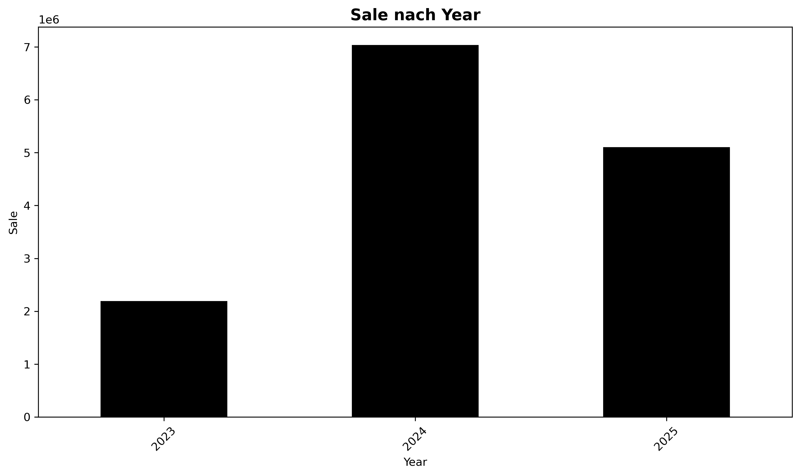
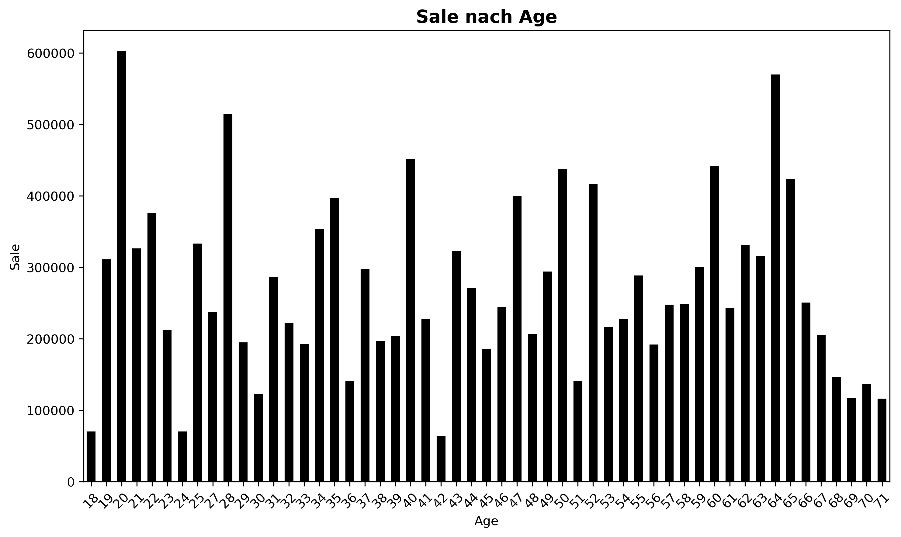
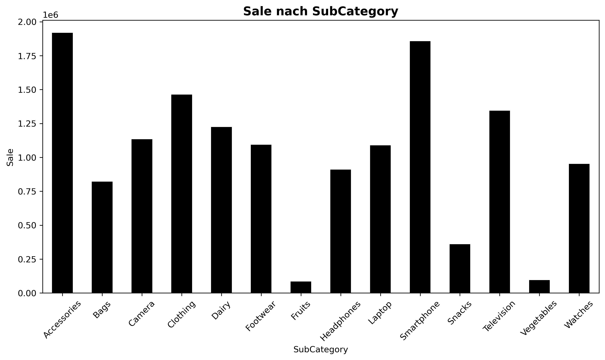
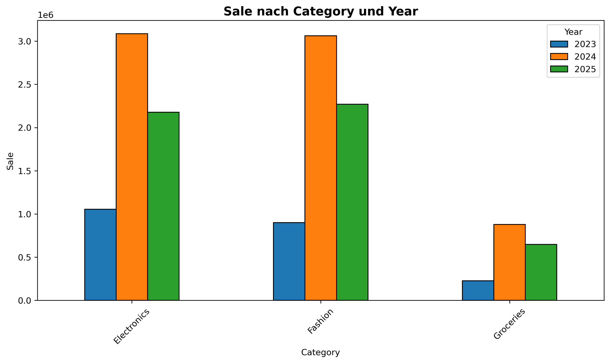
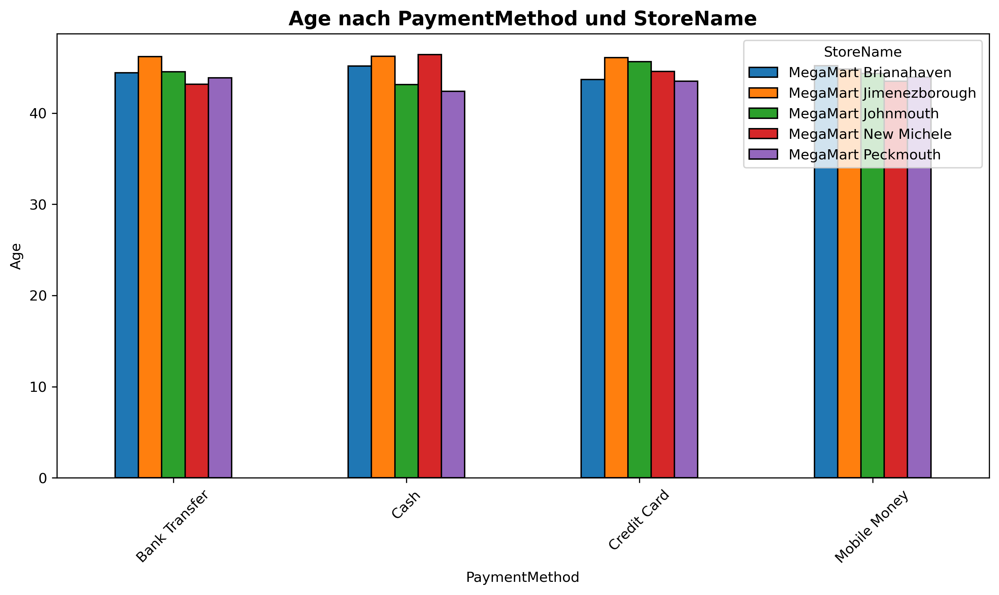
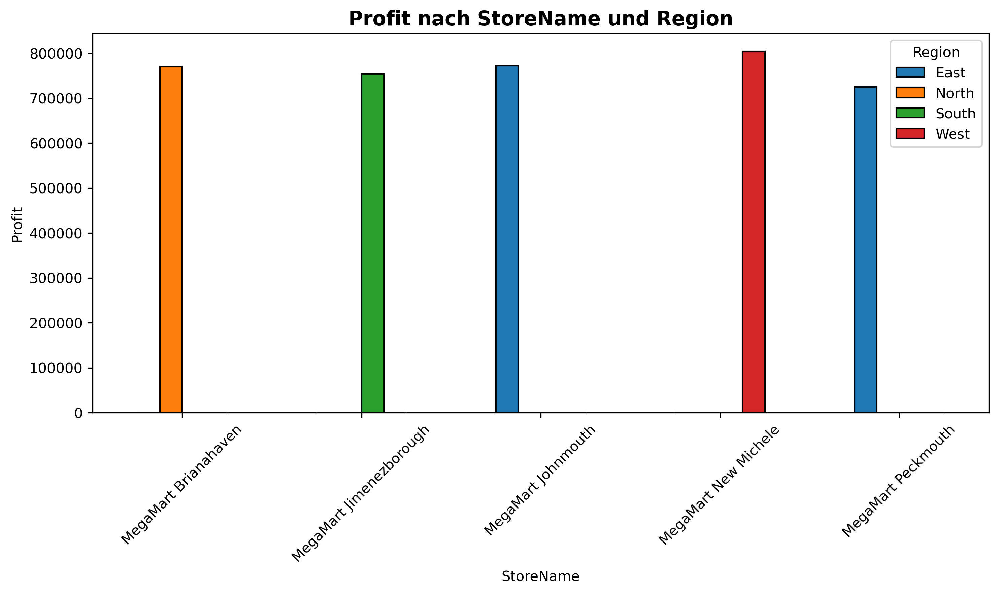
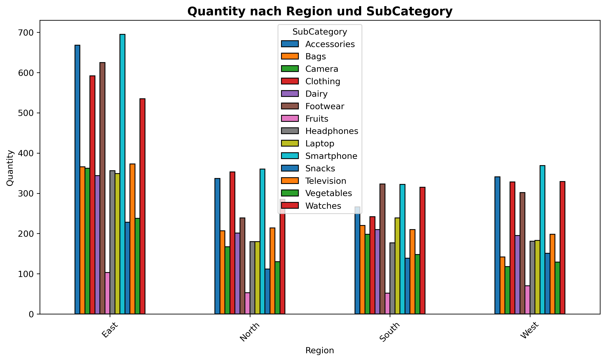

# Retail Sales
Dieses Projekt ist ein **interaktives Python-Programm** zur Analyse eines Retail Sales Datensatzes. Es kombiniert Datenanalyse, KPI-Berechnung und Visualisierung mit einem **OOP-basierten** Menüsystem, sodass der Benutzer flexibel Analysen durchführen und Plots erstellen kann.

Das Programm nutzt Bibliotheken wie **pandas**, **numpy** und **matplotlib**.


## Projektübersicht
- **Ziel:** Benutzer sollen wichtige KPIs berechnen und interaktive Analysen durchführen können. Alle Berechnungen können nach Wunsch angepasst werden.
- **Datenbasis:** Retail Sales Dataset (über 5.000 Transaktionen) mit Kunden-, Produkt-, Store- und Transaktionsinformationen.
- **Technologien:** Python, pandas, matplotlib, openpyxl.

## Features
* **Interaktive Menüs**
  * **Captcha-Login** zur Sicherheit
  * Hauptmenü für KPIs und Plots
  * KPI-Untermenü für flexible Analysen
  ### Bedienung der Menüs
  - Das Programm ist **vollständig interaktiv**.  
  - Alle Menüs werden über **Nummerneingabe** gesteuert.
* **Datenanalyse**
  * Umsatz, Gewinn, Menge, Rabatt, etc.
  * Top/Bottom X Analysen für Kunden, Produkte oder Stores
  * Loyal Customers identifizieren
* **Visualisierung**
  * **Balkendiagramme** automatisch erstellen und speichern
* **Benutzerfreundlichkeit**
  * Eingaben sind **Groß-/Kleinschreibung-resistent**
  * Beispiel: `Store`, `store`, `STORE` oder `sToRe` werden alle korrekt erkannt.
  * Positive Ganzzahlen werden validiert


## Datensatz
Das Dataset besteht aus **4 Tabellen**, die eine **Star Schema Struktur** haben:

1. **Customers**  
   - Key: `CustomerID`  
   - Spalten: Vorname, Nachname, Gender, BirthDate, City, JoinDate

2. **Products**  
   - Key: `ProductID`  
   - Spalten: Name, Kategorie, Subkategorie, UnitPrice, CostPrice

3. **Stores**  
   - Key: `StoreID`  
   - Spalten: StoreName, City, Region

4. **Transactions**  
   - Key: `TransactionID`  
   - Spalten: Date, CustomerID, ProductID, StoreID, Quantity, Discount, PaymentMethod 

Alle Tabellen werden automatisch zusammengeführt (data_loader.py).
Zusätzlich werden folgende Spalten berechnet:
* **Sale:** Quantity * UnitPrice * (1 - Discount)
* **Profit:** Sale - (CostPrice * Quantity)
* **Age:** (today - BirthDate)
* **Tenure:** (today - JoinDate)
* **Year:** Jahr der Transaktion aus dem Date-Feld

**Diese Spalten werden für KPI-Berechnungen, Top/Bottom Analysen und Plots verwendet.**


---
## Interaktive Nutzung

### 1. Anmeldung
Ein einfacher Captcha-Check schützt vor automatisierten Zugriffen.
Benutzer müssen eine kleine Rechenaufgabe lösen, z. B. 7 + 3 = ?

### 2. Hauptmenü
Nach erfolgreichem Login öffnet sich das Hauptmenü:
1. KPIs berechnen
2. Umsatzplots anzeigen
0. Abmelden / Beenden

### 3. KPI-Untermenü

Im KPI-Menü stehen folgende Optionen zur Verfügung:

1. Anzahl eindeutiger Kategorien
    * Zählt Kunden, Produkte, Stores oder Transaktionen.

2. Interaktive KPI-Berechnung
Benutzer wählt:
    * KPI-Spalte (Sale, Profit, Quantity, Discount …)
    * Gruppierung (Store, Customer, Region …)
    * Aggregation (sum, mean, max, min)
    * Ausgabe: Berechnete KPIs

3. Top X Analyse
    * Zeigt die Top X Ergebnisse einer KPI an.
    * Beispiel: Top 5 Kunden nach Umsatz.

4. Bottom X Analyse
    * Zeigt die Bottom X Ergebnisse einer KPI an.
    * Beispiel: Bottom 5 Produkte nach Verkaufsmenge.

5. Loyal Customers
    * Zeigt Kunden mit mindestens X Transaktionen an.
    * Beispiel: Kunden mit ≥5 Einkäufen.

### Plots
* Über das Plot-Menü kann der Benutzer Balkendiagramme erstellen:
  * Wählt X- und Y-Achsen (numerisch/kategorisch)
  * Optional: Zweite Gruppierung für gestapelte Balken
* Plot wird automatisch gespeichert (plots/) und angezeigt.
* **Beispielplots**:
  * Umsatz nach Store, Kategorie, Alter
  * Gewinn pro Store oder Produkt
  * Top/Bottom Produkte

## Hinweise für Benutzer
* Alle Eingaben sind case-insensitive.
* Alle Eingaben werden auf Gültigkeit überprüft.
* Positive Ganzzahlen werden bei Abfragen automatisch geprüft.
* Keine Änderung am Originaldatensatz
* Plots werden hochauflösend gespeichert (300 DPI).


## Analysen & KPIs

Das Programm erlaubt dem Benutzer, interaktiv verschiedene Analysen und KPIs zu berechnen. Mögliche Optionen sind unter anderem:

- **Umsatz & Gewinn**
  - Gesamtumsatz, Umsatz nach Store, Region, Kategorie
  - Gewinn pro Transaktion und Gesamtprofit

- **Kunden-Analysen**
  - Anzahl Kunden, durchschnittlicher Umsatz pro Kunde
  - Loyalität: Kunden mit >35 Bestellungen

- **Produkte & Kategorien**
  - Top/Bottom Produkte nach Umsatz, Menge, Profit
  - Umsatz pro Kategorie über Jahre

- **Zeitliche Trends**
  - Umsatzverlauf über Jahre (Stores, Kategorien)
  - Jährliche Umsatztrends
  
- **Warenkorb**
  - Durchschnittlicher Warenkorbwert pro Transaktion

## Visualisierungen (Beispiele)

- Umsatz der Stores über die Jahre 


- Umsatz nach Alter


- Umsatz nach Produktkategorie


- Umsatz nach Kategorie über die Jahre



- Kundenalter nach Bezahlmethode und Store



- Gewinn nach Store und Region


- Verkaufsmenge nach Unterkategory und Region



## Verwendung

```bash
1. git clone https://github.com/feride-ylmz/data_exploration.git

2. cd data_exploration/src

3. pip install pandas numpy matplotlib openpyxl

4. python main.py 


Datensatz: https://www.kaggle.com/datasets/buharishehu/retail-sales-dataset


