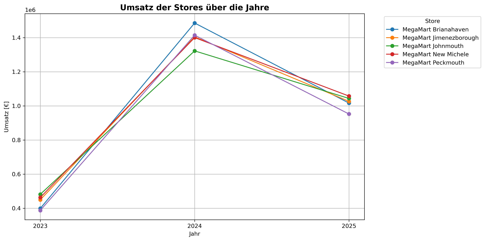
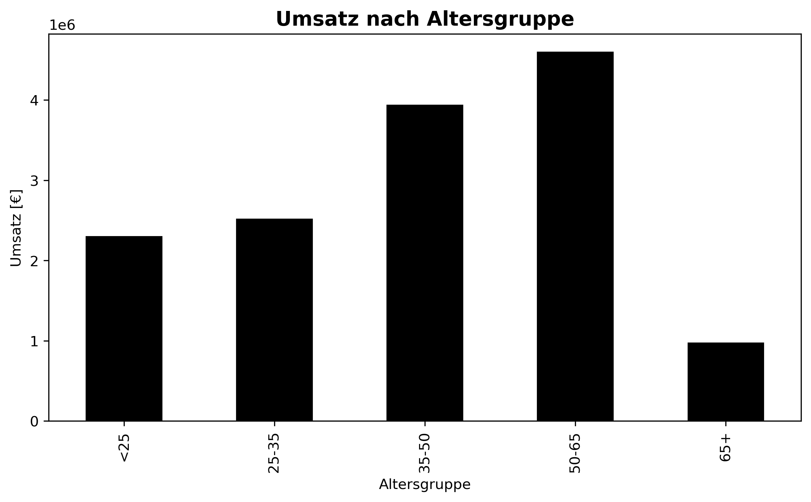
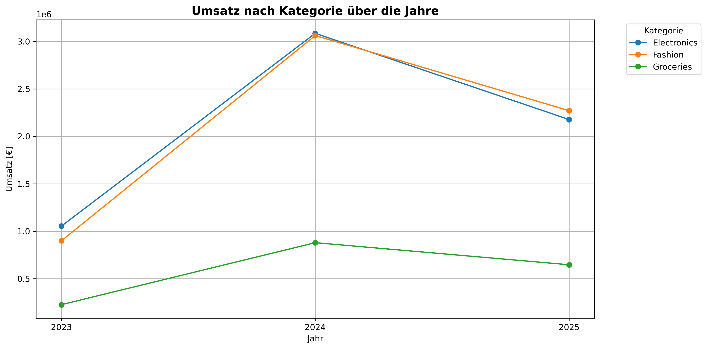
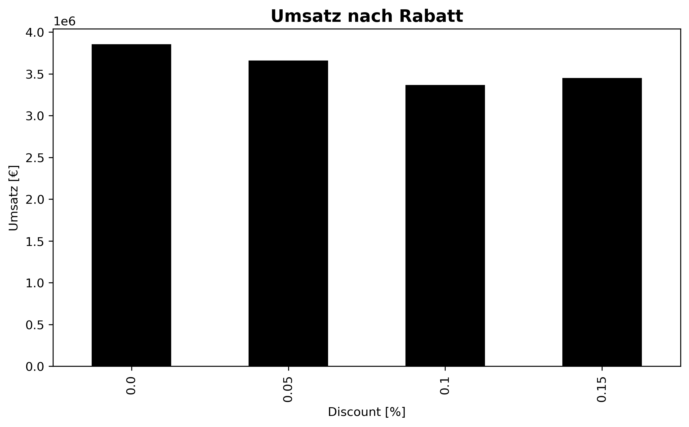
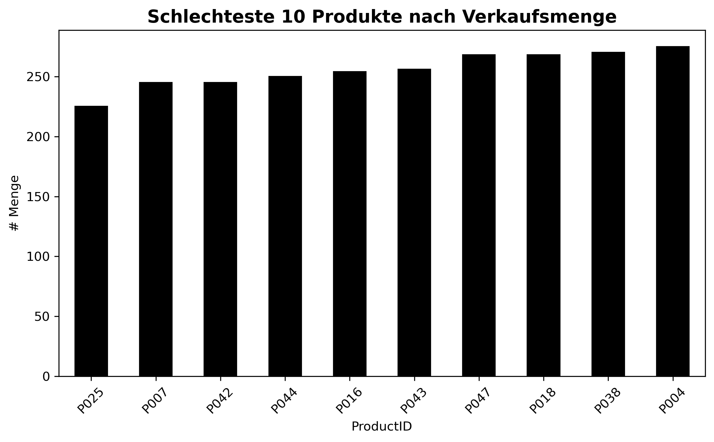

# Retail Sales
Dieses Projekt wurde im Rahmen einer Datenanalyse-Aufgabe erstellt, um Verkaufsdaten eines Einzelhandelsunternehmens zu untersuchen und analysiert ein **Retail Sales Dataset** mit über 5.000 Transaktionen, mehreren Stores, Kundeninformationen und Produktdetails. Ziel ist es, **Wichtige KPIs** zu berechnen und **visuelle Analysen** mit Python (pandas, matplotlib) zu erstellen.

Das Dataset besteht aus **4 Tabellen**, die eine **Star Schema Struktur** haben:

1. **Customers**  
   - Key: `CustomerID`  
   - Spalten: Vorname, Nachname, Gender, BirthDate, City, JoinDate  
   - Analysen: Altersgruppen, Mitgliedsdauer, Umsatz nach Kundensegmente

2. **Products**  
   - Key: `ProductID`  
   - Spalten: Name, Kategorie, Subkategorie, UnitPrice, CostPrice  
   - Analysen: Gewinnberechnung, Umsatz nach Kategorie, Top/Bottom Produkte

3. **Stores**  
   - Key: `StoreID`  
   - Spalten: StoreName, City, Region  
   - Analysen: Umsatz pro Store, Region, Trends über Jahre

4. **Transactions**  
   - Key: `TransactionID`  
   - Spalten: Date, CustomerID, ProductID, StoreID, Quantity, Discount, PaymentMethod  
   - Analysen: Umsatz, Gewinn, Rabatt-Auswirkungen, Warenkorbwert

---

## Analysen & KPIs

- **Umsatz & Gewinn**
  - Gesamtumsatz, Umsatz in 2025, Umsatz nach Store, Region, Kategorie
  - Gewinn pro Transaktion und Gesamtprofit

- **Kunden-Analysen**
  - Anzahl Kunden, durchschnittlicher Umsatz pro Kunde
  - Loyalität: Kunden mit >25 Bestellungen
  - Alters- & Demografie-Analysen

- **Produkte & Kategorien**
  - Top/Bottom Produkte nach Umsatz, Menge, Profit
  - Umsatz pro Kategorie über Jahre

- **Zeitliche Trends**
  - Umsatzverlauf über Jahre (Stores, Kategorien)
  - Jährliche Umsatztrends

- **Rabattanalyse**
  - Einfluss von Discounts auf den Umsatz

- **Warenkorb**
  - Durchschnittlicher Warenkorbwert pro Transaktion

## Visualisierungen

- Umsatz der Stores über die Jahre 


- Umsatz nach Altersgruppe


- Umsatz nach Produktkategorie


- Umsatz nach Kategorie über die Jahre


- Umsatz nach Rabatt


- Schlechteste 10 Produkte nach Verkaufsmenge


## Verwendung

```bash
1. git clone https://github.com/feride-ylmz/data_exploration.git

2. pip install pandas numpy matplotlib openpyxl

3. python script/retail_analysis.py

Die Plots werden automatisch im Ordner plots gespeichert.

Datensatz: https://www.kaggle.com/datasets/buharishehu/retail-sales-dataset


